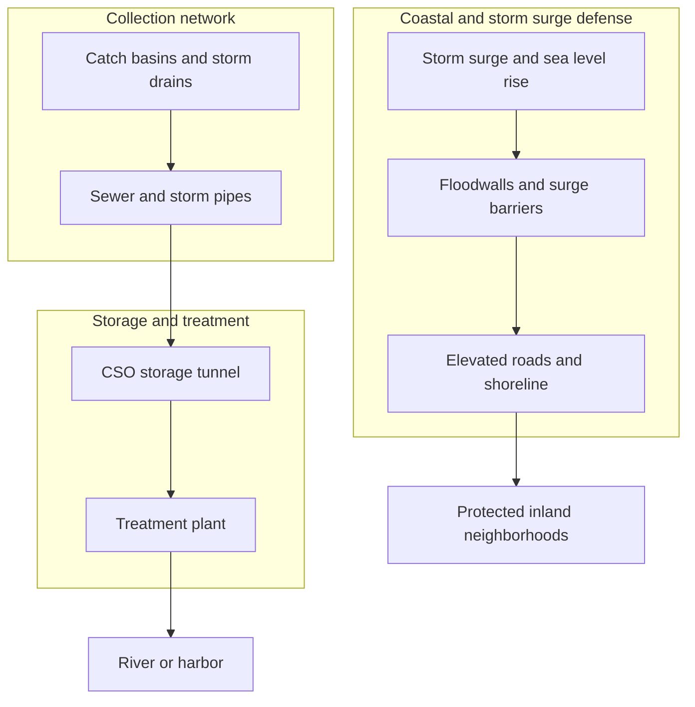

```mermaid
graph TD
  A[Catch basins and storm drains] --> B[Sewer and storm pipes]
  B --> C[CSO storage tunnel]
  C --> D[Treatment plant]
  D --> E[River or harbor]
  F[Storm surge and sea level rise] --> G[Floodwalls and surge barriers]
  G --> H[Elevated roads and shoreline]
  H --> I[Protected inland neighborhoods]

  subgraph Collection network
    A
    B
  end
  subgraph Storage and treatment
    C
    D
  end
  subgraph Coastal and storm surge defense
    F
    G
    H
  end
```

You can drop this straight into any mermaid renderer (GitHub markdown, Mermaid Live Editor, Notion, etc.) and it'll produce the same diagram shown above.
